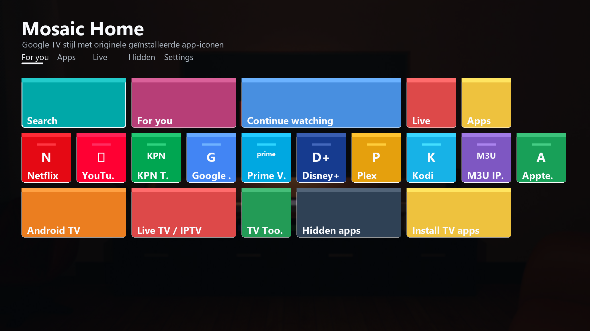
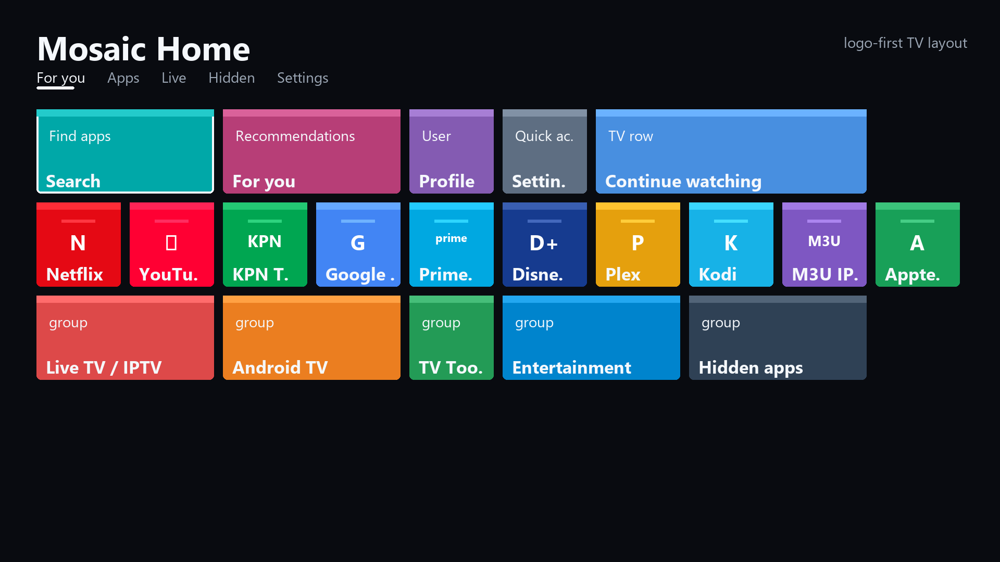
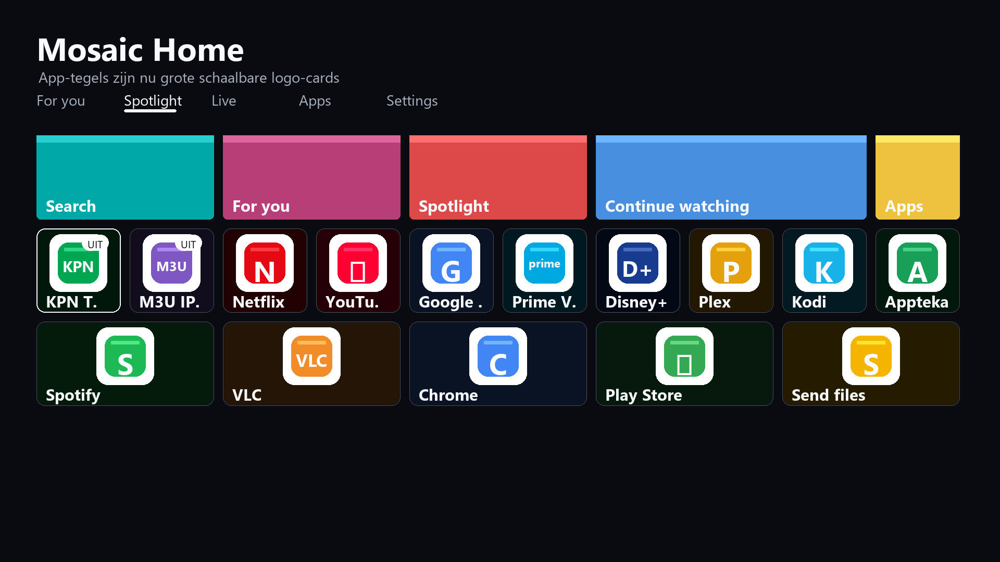
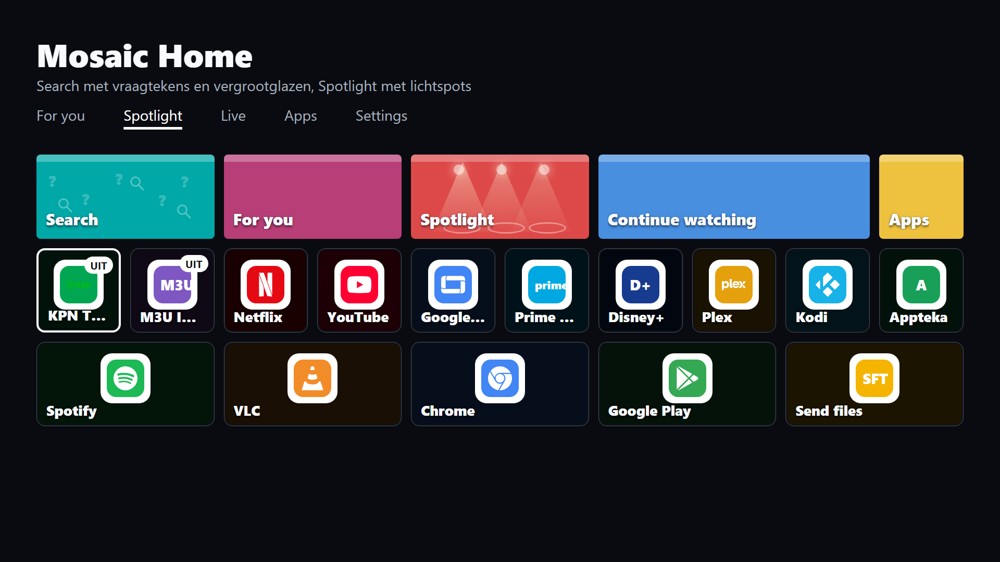
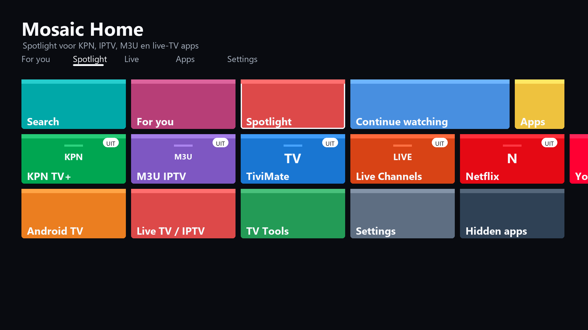
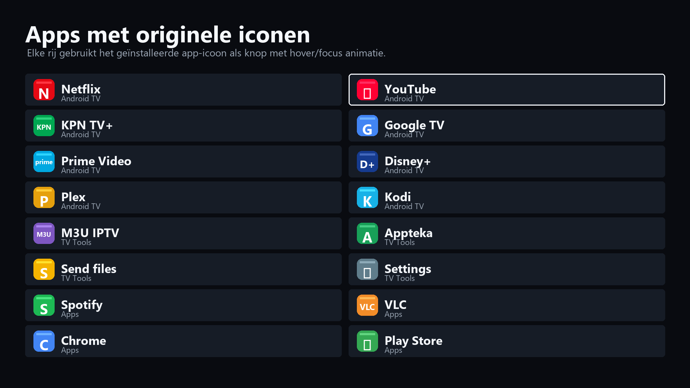
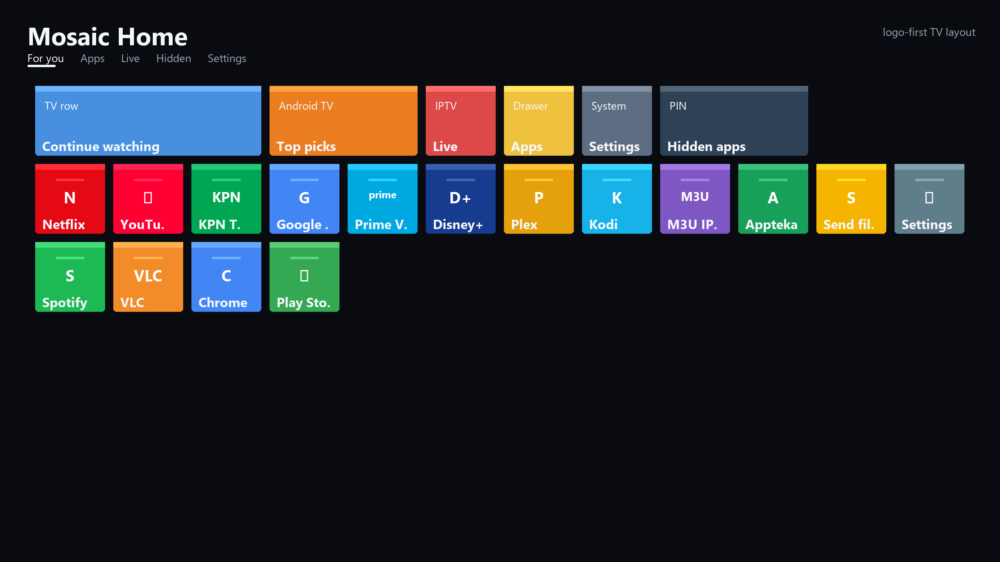
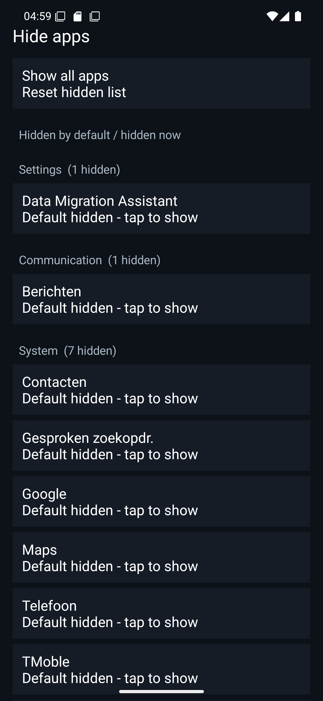

# Mosaic Home

Fast native Android launcher for Android TV boxes, tablets, phones, monitors, and touch screens.

Mosaic Home combines a Square Home-style tile launcher with a Google TV / Android TV layout: automatic app groups, original installed app icons, TV remote navigation, presets, hidden apps, and a lightweight native Android UI.



## Download

- Debug APK: [outputs/MosaicHome-debug.apk](outputs/MosaicHome-debug.apk)
- Visual sources: [outputs/visual-sources.md](outputs/visual-sources.md)
- Official TV app links: [outputs/official-tv-app-links.md](outputs/official-tv-app-links.md)

## Screenshots

### Google TV Style Home



### Scalable App Logo Cards



### Patterned Action Tiles



### KPN / IPTV Spotlight



### App Drawer With Logo Buttons



### Wide Monitor / TV Layout



### Android TV Standard Preset


### Hidden Apps And Groups



## Highlights

- Native Android launcher with HOME, LAUNCHER, and LEANBACK launcher support.
- Google TV style default preset with For You, Continue Watching, Live, Apps, and Settings rows.
- Automatic app grouping for Android TV, Live TV / IPTV, Entertainment, TV Tools, Music, Games, Settings, Communication, Productivity, Media, Browser, Tools, Shopping, System, and Other.
- Automatic Spotlight row for KPN TV+, IPTV, M3U, live-TV, and similar entertainment apps.
- Original installed app icons are used as logo buttons on home tiles, app lists, search results, and group pages.
- App tiles use scalable logo-card rendering, so installed app logos stay readable on phones, tablets, TVs, and monitors.
- Action tiles can use contextual backgrounds, such as question marks and magnifiers for Search and light beams for Spotlight.
- Mouse and air-mouse hover animation enlarges app logos and highlights focused rows.
- Hidden apps menu with default-hidden system/duplicate apps and optional PIN protection.
- Twelve presets: Google TV style, Android TV standard, Entertainment first, TV leanback, Monitor dashboard, Work focus, Minimal essentials, Gaming, Media studio, Family clean, Travel mode, and System admin.
- Official install-links menu for common TV-box apps: Netflix, KPN TV+, M3U IPTV, Appteka, and Send files to TV.
- TV remote and keyboard navigation with DPAD, enter, search, and menu.
- Live notification badges, backup/import, theme presets, live-info tiles, and fast system actions.

## Design Goals

- Fast: native Java Android view rendering, no web shell.
- Light: no bundled third-party app logos; Android supplies real installed app icons.
- TV friendly: large hit targets, focus rings, remote navigation, and monitor-scale presets.
- Practical: settings apps grouped together, entertainment apps up front, hidden apps separated by default.
- Smart: frequently used or TV-specific apps can jump into a spotlight row without manual sorting.

## Build

Use Android Studio or run:

```powershell
.\gradlew.bat assembleDebug --project-cache-dir work\.gradle-project
```

The debug APK is generated at:

```text
app/build/outputs/apk/debug/app-debug.apk
```
